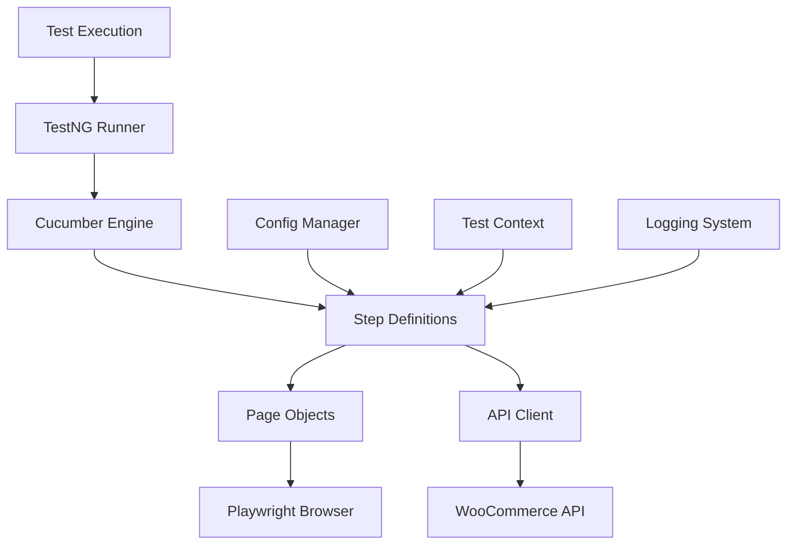

# 🛒 Playwright Java E-commerce Test Framework

[](https://openjdk.java.net/)
[](https://maven.apache.org/)
[](https://playwright.dev/)
[](https://testng.org/)
[](https://cucumber.io/)

A **professional-grade** test automation framework built with Java, Playwright, TestNG, and Cucumber for comprehensive e-commerce testing. This framework demonstrates modern test automation practices with robust architecture, comprehensive logging, and enterprise-ready features.

## 📋 Table of Contents

- [🚀 Features](#-features)
- [🏗️ Architecture](#️-architecture)
- [📁 Project Structure](#-project-structure)
- [🛠️ Prerequisites](#️-prerequisites)
- [⚡ Quick Start](#-quick-start)
- [🧪 Test Execution](#-test-execution)
- [📊 Test Cases](#-test-cases)
- [🔧 Configuration](#-configuration)
- [🔐 API Authentication](#-api-authentication)
- [📈 Reporting](#-reporting)
- [🐛 Debugging](#-debugging)
- [🚀 Advanced Usage](#-advanced-usage)
- [📝 Contributing](#-contributing)
- [📄 License](#-license)

## 🚀 Features

### **Core Capabilities**
- ✅ **Modern Tech Stack**: Java 17, Playwright, TestNG, Cucumber, REST Assured
- ✅ **Page Object Model**: Clean, maintainable page objects with centralized locator management
- ✅ **Dependency Injection**: Cucumber PicoContainer for shared object management across step definitions
- ✅ **Environment Management**: Support for dev, staging, and production environments
- ✅ **Professional Logging**: SLF4J with Logback for comprehensive logging and debugging
- ✅ **Tag-based Execution**: Run specific test suites using Maven profiles and Cucumber tags
- ✅ **Cross-browser Support**: WebKit, Firefox, and Chrome support with headless/headed modes
- ✅ **API Testing**: OAuth 1.0a authentication with WooCommerce REST API
- ✅ **Health Checks**: Built-in connectivity verification and credential validation
- ✅ **Parallel Execution**: Thread-safe test execution with unique data generation
- ✅ **Professional Reporting**: TestNG and Cucumber HTML reports with detailed logs

### **Enterprise Features**
- 🔒 **Secure Credential Management**: Environment variable substitution for API keys
- 🎯 **Test Isolation**: Unique email generation preventing parallel execution conflicts
- 📊 **Comprehensive Logging**: DEBUG level logging for full API request/response visibility
- 🏷️ **Test Case Management**: Integration with external test case IDs (ECOM-XXX)
- 🔄 **CI/CD Ready**: Professional shell scripts for automated test execution
- 📈 **Scalable Architecture**: Modular design supporting thousands of tests

## 🏗️ Architecture



## 📁 Project Structure

```
playwright-java-ecom-framework/
├── 📁 src/
│   ├── 📁 main/java/com/ecom/automation/
│   │   ├── 📁 config/          # Environment configuration management
│   │   │   └── ConfigManager.java
│   │   ├── 📁 factory/         # Object creation patterns
│   │   │   └── PageFactory.java
│   │   ├── 📁 locators/        # Centralized locator management
│   │   │   └── HomePageLocators.java
│   │   ├── 📁 pages/           # Page Object Model classes
│   │   │   └── HomePage.java
│   │   ├── 📁 api/             # API testing components
│   │   │   ├── SimpleOAuthClient.java
│   │   │   └── BaseApiTest.java
│   │   └── 📁 utils/           # Utility classes
│   │       ├── ApiCredentialValidator.java
│   │       └── TestUtils.java
│   └── 📁 test/
│       ├── 📁 java/com/ecom/automation/
│       │   ├── 📁 stepdefinitions/  # Cucumber step definitions
│       │   │   ├── HomepageStepDefinitions.java
│       │   │   ├── CustomerApiStepDefinitions.java
│       │   │   └── Hooks.java
│       │   └── 📁 testrunners/      # TestNG test runners
│       │       ├── HomepageTestRunner.java
│       │       └── ApiTestRunner.java
│       └── 📁 resources/
│           ├── 📁 config/           # Environment-specific configs
│           │   ├── dev.properties
│           │   ├── staging.properties
│           │   └── prod.properties
│           ├── 📁 features/         # Gherkin feature files
│           │   ├── 📁 frontend/     # UI automation features
│           │   │   ├── homepage.feature
│           │   │   └── README.md
│           │   └── 📁 backend/      # API testing features
│           │       ├── customer-api.feature
│           │       └── README.md
│           ├── testng.xml          # TestNG suite configuration
│           └── logback-test.xml    # Logging configuration
├── 📄 pom.xml                     # Maven configuration
├── 🐚 run-frontend-tests.sh       # Frontend test execution script
├── 🐚 run-backend-tests.sh        # Backend test execution script
├── 🐚 test-api.sh                 # API connectivity test script
└── 📄 README.md                   # This file
```

## 🛠️ Prerequisites

### **Required Software**
- **Java 17** or higher ([Download](https://openjdk.java.net/))
- **Maven 3.6** or higher ([Download](https://maven.apache.org/download.cgi))
- **Git** ([Download](https://git-scm.com/))

### **Verify Installation**
```bash
# Check Java version
java -version

# Check Maven version
mvn -version

# Check Git version
git --version
```

## ⚡ Quick Start

### **1. Clone and Setup**
```bash
# Clone the repository
git clone <repository-url>
cd playwright-java-ecom-framework

# Verify project structure
ls -la
```

### **2. Run Tests**
```bash
# Run all tests (UI + API)
mvn test

# Run with specific environment
mvn test -Denv=staging

# Run with custom browser
mvn test -Dbrowser=webkit -Dheadless=false
```

### **3. Verify Setup**
```bash
# Test API connectivity
./test-api.sh

# Run frontend tests only
./run-frontend-tests.sh

# Run backend tests only
./run-backend-tests.sh
```

## 🧪 Test Execution

### **Maven Commands**

| Command | Description | Example |
|---------|-------------|---------|
| `mvn test` | Run all tests | `mvn test` |
| `mvn test -Dtest=Runner` | Run specific test runner | `mvn test -Dtest=HomepageTestRunner` |
| `mvn test -Dtag=ECOM-1` | Run by tag (short syntax) | `mvn test -Dtag=ECOM-1` |
| `mvn test -Dcucumber.filter.tags="@ECOM-1"` | Run by tag (full syntax) | `mvn test -Dcucumber.filter.tags="@ECOM-1"` |
| `mvn test -Denv=staging` | Run with specific environment | `mvn test -Denv=staging` |
| `mvn test -Dbrowser=webkit` | Run with specific browser | `mvn test -Dbrowser=webkit` |
| `mvn test -Dheadless=false` | Run in headed mode | `mvn test -Dheadless=false` |

### **Shell Scripts**

| Script | Purpose | Usage |
|--------|---------|-------|
| `./run-frontend-tests.sh` | Run all frontend tests | `./run-frontend-tests.sh` |
| `./run-backend-tests.sh` | Run all backend tests | `./run-backend-tests.sh` |
| `./test-api.sh` | Test API connectivity | `./test-api.sh` |

### **Environment Variables for Backend Tests**
```bash
export API_CONSUMER_KEY="your_consumer_key"
export API_CONSUMER_SECRET="your_consumer_secret"
export API_BASE_URL="https://your-store.com/wp-json/wc/v3"
```

## 📊 Test Cases

### **Frontend Tests (UI Automation)**

| Test ID | Description | Status |
|---------|-------------|--------|
| **ECOM-1** | Verify 16 products are displayed on homepage | ✅ |
| **ECOM-2** | Verify 4 columns of products are displayed | ✅ |
| **ECOM-3** | Verify 4 rows of products are displayed | ✅ |
| **ECOM-5** | Verify sorting dropdown is displayed at top | ✅ |
| **ECOM-6** | Verify sorting dropdown is displayed at bottom | ✅ |
| **ECOM-7** | Verify "shop" heading is displayed | ✅ |
| **ECOM-8** | Verify header menu is displayed | ✅ |

### **Backend Tests (API Testing)**

| Test ID | Description | Endpoint | Status |
|---------|-------------|----------|--------|
| **ECOM-165** | Verify POST /customers creates user with email and password only | `POST /customers` | ✅ |
| **ECOM-166** | Verify GET /customers lists all users | `GET /customers` | ✅ |
| **ECOM-167** | Verify POST /customers fails if password not provided | `POST /customers` | ✅ |
| **ECOM-168** | Verify create customer with only email and password has names as empty string | `POST /customers` | ✅ |
| **ECOM-169** | Verify username is autogenerated based on email | `POST /customers` | ✅ |
| **ECOM-170** | Verify create customer fails if email exists | `POST /customers` | ✅ |
| **ECOM-171** | Verify status code 404 for non-existing customer | `GET /customers/{id}` | ✅ |
| **ECOM-172** | Verify get customer by id returns one customer | `GET /customers/{id}` | ✅ |

## 🔧 Configuration

### **Environment Configuration**
Environment-specific configurations are managed in `src/test/resources/config/`:

#### **dev.properties** (Development)
```properties
# Base URL
base.url=http://demostore.supersqa.com

# Browser Configuration
browser=webkit
headless=true
timeout=30000

# API Configuration
api.base.url=${API_BASE_URL:http://demostore.supersqa.com/wp-json/wc/v3}
api.consumer.key=${API_CONSUMER_KEY:your_consumer_key}
api.consumer.secret=${API_CONSUMER_SECRET:your_consumer_secret}
```

#### **staging.properties** (Staging)
```properties
base.url=https://staging-demo.supersqa.com
browser=webkit
headless=true
timeout=30000
```

#### **prod.properties** (Production)
```properties
base.url=https://demo.supersqa.com
browser=webkit
headless=true
timeout=30000
```

### **Maven Profiles**
```xml
<!-- Tag-based execution profiles -->
<profile>
    <id>tag</id>
    <activation>
        <property>
            <name>tag</name>
        </property>
    </activation>
    <properties>
        <cucumber.filter.tags>@${tag}</cucumber.filter.tags>
    </properties>
</profile>
```

## 🔐 API Authentication

### **OAuth 1.0a Setup**
The framework uses OAuth 1.0a with HMAC-SHA1 signature for WooCommerce API authentication.

#### **Required Credentials**
```bash
# Set environment variables
export API_CONSUMER_KEY="ck_your_consumer_key_here"
export API_CONSUMER_SECRET="cs_your_consumer_secret_here"
export API_BASE_URL="https://your-store.com/wp-json/wc/v3"
```

#### **Authentication Flow**
1. **Consumer Key/Secret**: Obtained from WooCommerce REST API settings
2. **OAuth 1.0a**: HMAC-SHA1 signature generation
3. **Request Signing**: Automatic signature generation for each API call
4. **Credential Validation**: Built-in validation with clear error messages

#### **Test API Connectivity**
```bash
# Quick API test
./test-api.sh

# Or manually
mvn test -Dtest=SimpleCustomerApiTest
```

## 📈 Reporting

### **TestNG Reports**
- **Location**: `target/surefire-reports/index.html`
- **Features**: Complete test execution summary, logs, tags, pass/fail status
- **Best for**: Overall test results and detailed analysis

### **Cucumber Reports**
- **Location**: `target/cucumber-reports/api-html-report` (API tests)
- **Location**: `target/cucumber-reports/html` (Frontend tests)
- **Features**: Gherkin scenario visualization, step-by-step execution
- **Best for**: BDD test coverage and scenario analysis

### **Access Reports**
```bash
# Open TestNG report
open target/surefire-reports/index.html

# Open Cucumber report
open target/cucumber-reports/api-html-report
```

## 🐛 Debugging

### **Enable Debug Logging**
The framework includes comprehensive logging at DEBUG level:

```bash
# Run with full debug output
mvn test -Dtest=ApiTestRunner -q

# Check logs for API responses
grep "OAuth.*response" target/surefire-reports/*.txt
```

### **Common Debug Scenarios**

#### **API Test Failures**
```bash
# Check API credentials
./test-api.sh

# Run specific failing test
mvn test -Dtest=ApiTestRunner -Dcucumber.filter.tags="@ECOM-165" -q
```

#### **UI Test Failures**
```bash
# Run in headed mode for visual debugging
mvn test -Dtest=HomepageTestRunner -Dheadless=false

# Run specific UI test
mvn test -Dtest=HomepageTestRunner -Dtag=ECOM-1
```

### **Log Levels**
- **INFO**: Test execution flow and results
- **DEBUG**: Full API request/response details
- **ERROR**: Failure details with context

## 🚀 Advanced Usage

### **Custom Test Execution**
```bash
# Run multiple tags
mvn test -Dcucumber.filter.tags="@ECOM-1 or @ECOM-2"

# Run with custom parallel threads
mvn test -Dparallel=4

# Run with custom timeout
mvn test -Dtimeout=60000
```

### **CI/CD Integration**
```yaml
# Example GitHub Actions workflow
- name: Run Frontend Tests
  run: ./run-frontend-tests.sh

- name: Run Backend Tests
  env:
    API_CONSUMER_KEY: ${{ secrets.API_CONSUMER_KEY }}
    API_CONSUMER_SECRET: ${{ secrets.API_CONSUMER_SECRET }}
  run: ./run-backend-tests.sh
```

### **Custom Configuration**
```bash
# Override configuration properties
mvn test -Dbase.url=https://custom-store.com -Dbrowser=chrome
```

## 📝 Contributing

### **Development Workflow**
1. **Fork** the repository
2. **Create** a feature branch: `git checkout -b feature/your-feature-name`
3. **Make** your changes
4. **Run** tests: `mvn test`
5. **Commit** changes: `git commit -m "Add your feature"`
6. **Push** to branch: `git push origin feature/your-feature-name`
7. **Create** a Pull Request

### **Code Standards**
- Follow Java naming conventions
- Add comprehensive logging
- Include proper error handling
- Write clear, maintainable code
- Update documentation as needed

### **Testing Requirements**
- All tests must pass before submitting PR
- New features must include appropriate tests
- Update test documentation if needed

## 📄 License

This project is licensed under the **MIT License** - see the [LICENSE](LICENSE) file for details.

---

## 🤝 Support

For questions, issues, or contributions:
- 📧 **Email**: [your-email@example.com]
- 🐛 **Issues**: [GitHub Issues](https://github.com/your-username/playwright-java-ecom-framework/issues)
- 📖 **Documentation**: [Wiki](https://github.com/your-username/playwright-java-ecom-framework/wiki)

---

<div align="center">

**Built with ❤️ for professional test automation**

[⬆ Back to Top](#-playwright-java-ecommerce-test-framework)

</div>